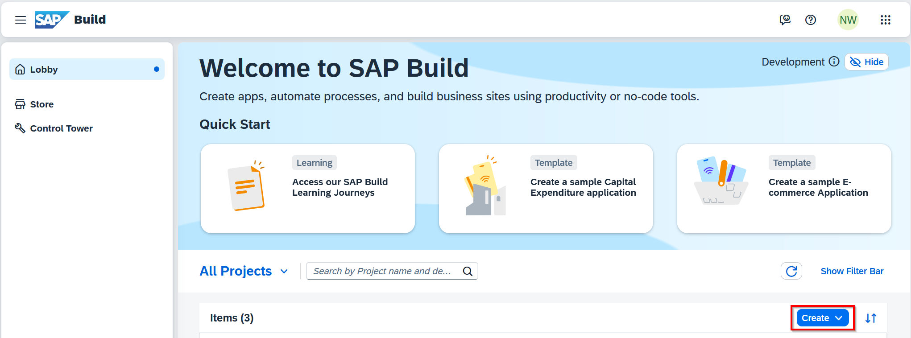
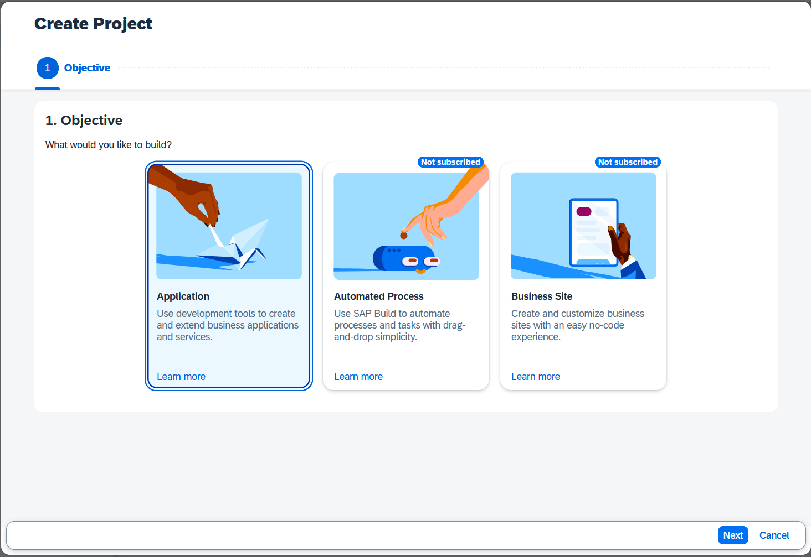
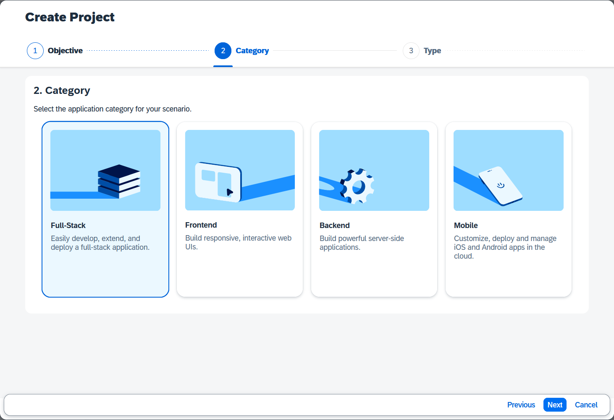
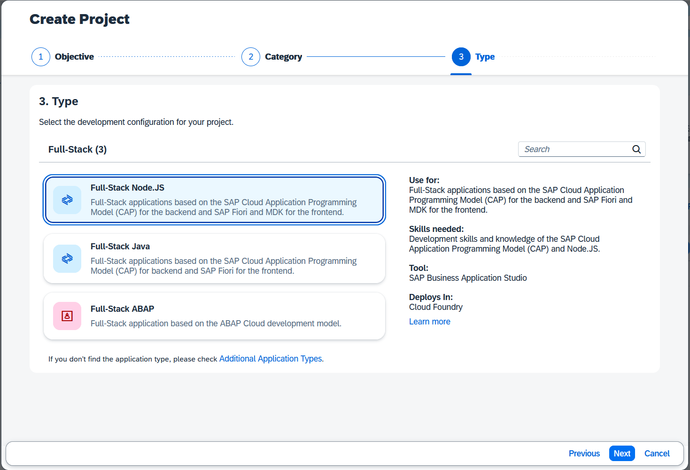
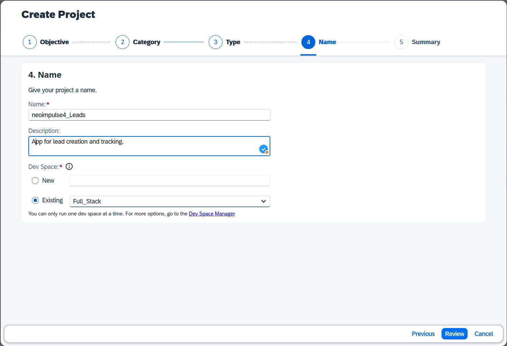
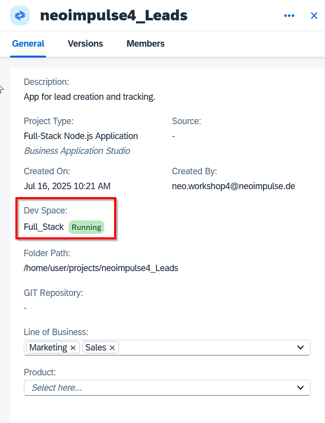
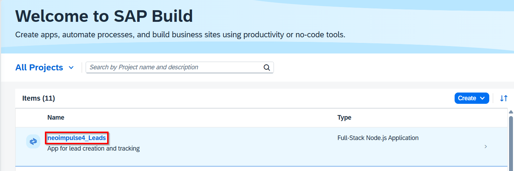

# 2. Project Creation

Now that you're in SAP Business Application Studio, let's create a new full-stack application.

---

## Create a New Project

1. Click **Create** button and choose **create**

2. Choose **Application** and **Next**

3. Select **Full-Stack** and **Next**

4. Use Full-Stack **Node.JS** for our example

5. Enter Project Details
* **Project Name:** Enter a meaningful name for your application (e.g., `UserName_Leads`).
* **Project Description:** Provide a short description (e.g., `A app for lead creation`).
* **Dev Space:** For our example we are going to use the existing **Full_Stack** space.

7. Review your project **summary** and press create

Info: Creating a project might take a while, it can take up to 1 minute.

---

## 🔍 Inspect Your Project

Now that you’re checking out your project details again, you’ll notice you can **create versions** and **add team members** to collaborate. 🚀

No need to tweak anything just yet — we’re good for now.

Just take a moment to **check the status** of your **Dev Space**. Right after creation, it should be set to **Running** 🟢.  
Why? Because it needs to be running to jump into action via **BAS** (Business Application Studio). 

---

## Connect to a Repository (Not part of this workshop)

For better version control and collaboration, you can link your project to a Git repository.

As we are not going to keep your project, we are not connecting to any remote-/repository such as AzureDevops or Github. 

---

## Next Step

With your project structure ready, we'll now see how Joule AI can supercharge our initial application development using the Project Accelerator. 

**Click on your project name to start BAS**

[Go to 3. Joule & Project Accelerator >>](3_Joule_and_Project_Accelerator.md)