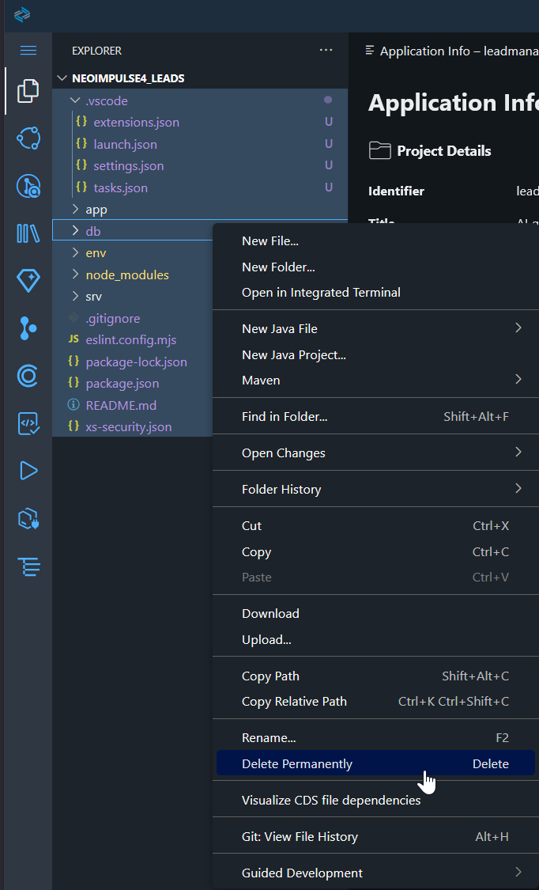
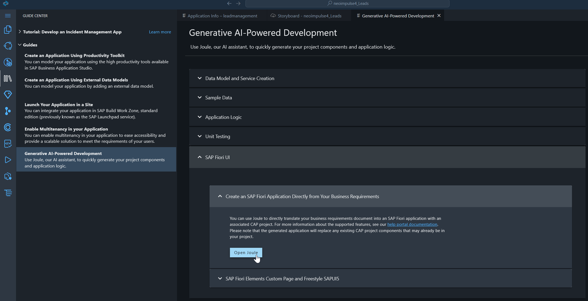
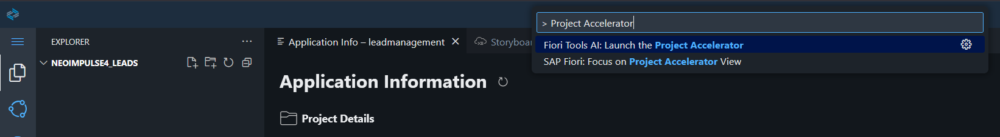
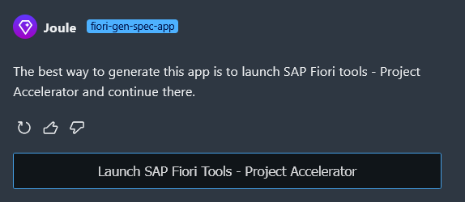
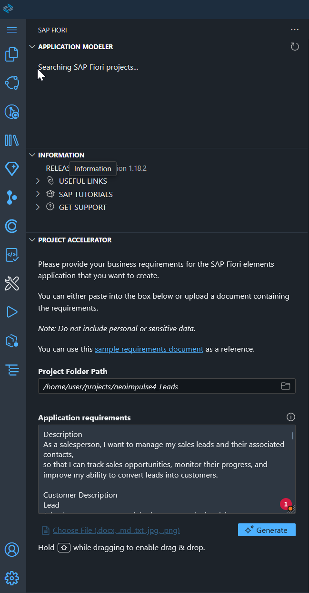
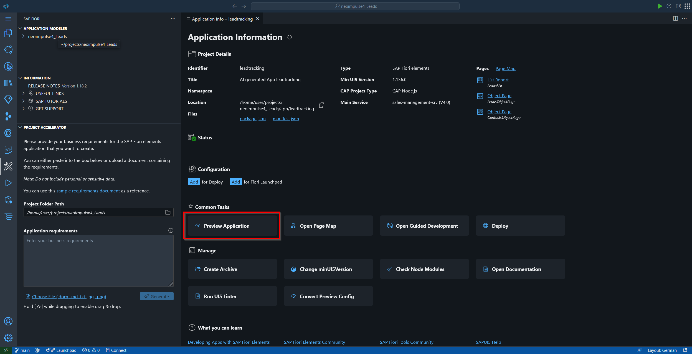
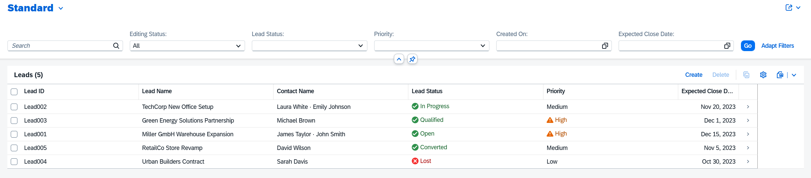

# 3. Joule & Project Accelerator

Joule AI's **Project Accelerator** is a powerful feature that allows you to generate application code based on natural language descriptions or images.

---

## Hint for Best Performance

* **One App Per Accelerator:** For optimal results and clarity, focus on generating one specific application or a distinct module per Project Accelerator run.
* **English Input:** Providing your prompts and images in **English** generally yields the best and most accurate results.

---

## Preperation

Before we can generate we need to get rid of the pre created template project that the Build Code platform creates. 

Go to files select all with CTRL+A and press delete. 

Now we have a clean empty workspace in which we can start our project generation.

---

## Create Project from Scratch with Joule

Let's use the **Project Accelerator** to kickstart our application based on a user story. 

1.  Go to **Guide Center/Guides/Generative AI-Powered Development** and choose **SAP Fiori UI** 

Alternatively open **Project Accelerator** right away in via your search

2. Go to the following [user story](99_User_Story.md), read and copy it 

3. You startetd Joule via Guide Center? No, then go to Step 4. Yes? Good, now witness what happens when you promt. 

Congratualtions you also need to open the **Project Accelerator**. Why? Nobody knows. 

4. You have already chosen the right tool to get started. Now prompt the whole user story into the **Application requirements** and press **Generate**

5. When the Application Information board comes up your app es ready to inpsect. Press **Previw Application** to open and choose `CDS watch`.

6. Now after trying your app we are going to inspect what actually happend on your own. Checkout the project structure and make sure to visit the `manifest.json` and `annotations.cds`. What do you notice?

---

## Key Takeaway

### Context is King!

The more context and detailed feature descriptions you provide to Joule, the better and more accurate the generated application will be. Think of it as providing a comprehensive brief to a developer. 

What should it contain: 
- The **overall User Story** in one or two sentences including user role. 
- A description of **each entity** (none technical is ok). 
- **Attribute description**. What each attribute should contain or represent
- A szenario with functionality as acceptance criteria per view/page. 

### It is not a chat 

When you are used to other AIs you get to chat to increas context depth. However, that is not the case with the project accelerator. You only get one shot to jumpstart your project. If your description or picture is poorly you will need to delete all generated and prompt a better description agian. 

### It's Fiori Elements only

If you jumpstart your project with the accelerator you will get a Fiori Elements Application. Even if you would prompt to Joule that it should do Freestyle, it will ignore it. What does that mean for you? It is perfect for prototyping, perfect for standard or small scope apps and initial list views. 

If you want to go Freestyle or need to do so, will need to use Joule itself. (next Step)

---

## Next Step

You've now seen how Joule can rapidly create an application foundation. Next, we'll use Joule to adapt and enhance this generated app with a freestyle page.

[Go to 4. Enhancing with Joule >>](4_Enhancing_with_Joule.md)